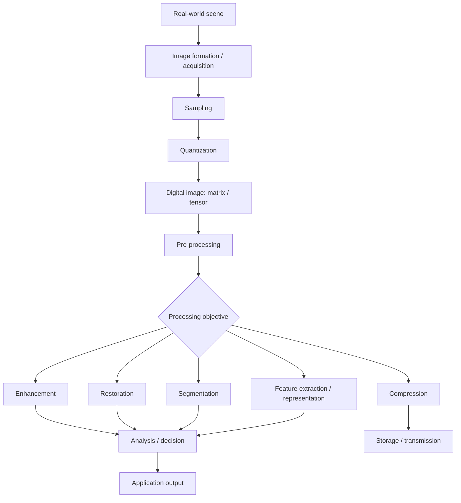

# Chapter 01 — Digital Image Processing: The Big Picture

> **Chapter thesis**
> A digital image is not merely a picture stored on a computer. It is a structured numerical representation of a scene, and digital image processing is the disciplined transformation, analysis, storage, and interpretation of that representation.

**Part I — The Image**  
**Syllabus anchor:** Unit I — fundamentals of image processing; image formation; sampling and quantization; image types and representation.

---

## 01.0 What this chapter is for

Digital Image Processing (DIP) becomes much easier once the subject is seen as one connected system instead of a collection of algorithms.

The University of Delhi syllabus begins with fundamentals, image formation, sampling and quantization, image types, representation, colour models, and file formats. Those topics are deliberately foundational: before asking an algorithm to improve, restore, segment, compress, or classify an image, we must know **what the image is, where its numbers came from, and what those numbers mean**.

This chapter establishes that mental model. Later chapters will reuse it constantly.

### Learning objectives

By the end of this chapter, you should be able to:

- define digital image processing in engineering terms;
- distinguish an image as a physical scene, a measured signal, and a digital data structure;
- describe the major stages of a practical image-processing pipeline;
- explain the difference between spatial, local, global, geometric, and transform-domain operations;
- identify the important information carried by an image: dimensions, channels, bit depth, dynamic range, datatype, and colour representation;
- perform small pixel-level calculations by hand;
- connect classical DIP operations to segmentation, feature extraction, compression, classification, and later CNN-based vision;
- identify common conceptual mistakes before they enter code or calculations.

---

## 01.1 What is Digital Image Processing?

### CORE — Working definition

**Digital Image Processing is the use of computational methods to manipulate, transform, enhance, restore, analyse, represent, compress, or otherwise extract useful information from digital images.**

That definition contains two ideas that should never be separated:

1. **Image as data** — the computer sees numerical values arranged in a spatial structure.
2. **Processing as a transformation** — an algorithm changes, analyses, or represents those values for a purpose.

A photograph, for example, may be processed to:

- improve visibility;
- reduce noise;
- remove blur;
- detect boundaries;
- separate foreground from background;
- extract features;
- reduce storage size;
- classify an object;
- locate an object;
- track motion across frames.

The same underlying image can therefore support very different tasks.

---

## 01.2 The three things called “the image”

A major source of confusion is using the word *image* for three different things.

### 1. The physical scene

The real-world object or environment exists before any camera or scanner measures it.

Examples:

- a face in front of a camera;
- a printed page under a scanner;
- a road viewed by a vehicle camera;
- tissue inside a medical scanner.

### 2. The measured signal

A sensor receives some physical quantity and converts it into an electrical or digital signal.

The sensor does **not** receive “pixels.” The pixels are part of the digital representation produced after acquisition and discretisation.

### 3. The digital image

The computer stores the acquired information as numerical samples.

For a grayscale image, a simple mathematical model is:

\[
f(x,y)
\]

where \(x\) and \(y\) describe spatial position and \(f\) describes image intensity at that position.

Once the image becomes digital, coordinates and intensity values are represented in discrete form, for example:

\[
f[m,n]
\]

or equivalently as a matrix.

### Mental model

```text
REAL WORLD SCENE
       │
       │ light / radiation / measured phenomenon
       ▼
SENSOR + ACQUISITION SYSTEM
       │
       │ analog or sampled signal
       ▼
SAMPLING + QUANTIZATION
       │
       ▼
DIGITAL IMAGE
       │
       │ numerical processing
       ▼
PROCESSED / ANALYSED IMAGE
       │
       ▼
HUMAN OR MACHINE DECISION
```

**DEEP DIVE:** This distinction becomes critical later. Restoration asks how a degraded observation arose from an original image; compression asks how a digital representation can be encoded more efficiently; CNNs ask how useful representations can be learned from image data.

---

## 01.3 Why do we process images?

A useful engineering question is not simply **“What can we do to an image?”** but **“What problem are we solving?”**

### Major goals of DIP

| Goal | Typical question | Example output |
|---|---|---|
| Acquisition | How do we turn a physical scene into usable image data? | Digital image |
| Enhancement | How can we make important visual information easier to see? | Higher-contrast image |
| Restoration | How can we estimate a degraded image more faithfully? | Deblurred / denoised estimate |
| Segmentation | Which pixels belong to the object or region of interest? | Binary or labelled regions |
| Feature extraction | What compact properties describe useful structure? | Edges, keypoints, descriptors |
| Compression | How can the image be stored/transmitted more efficiently? | Encoded bitstream |
| Classification | What category does the image belong to? | Class label |
| Detection | Which objects are present and where? | Bounding boxes + labels |
| Tracking | How does an object move over time? | Object trajectories / motion vectors |

The same input can pass through several of these stages.

---

# 01.4 The master Digital Image Processing pipeline

A practical DIP system can be viewed as a chain of representations and decisions.



### Important: this is a framework, not a mandatory sequence

A real system may use only a subset of these stages.

For example:

**Simple enhancement**

```text
Image → contrast adjustment → display
```

**OCR-style document analysis**

```text
Image
  ↓
Pre-processing
  ↓
Segmentation
  ↓
Feature / learned representation
  ↓
Recognition
  ↓
Text
```

**Object detection**

```text
Image
  ↓
Pre-processing (optional)
  ↓
Detector
  ↓
Bounding boxes + classes
```

**Image compression**

```text
Image
  ↓
Transformation / redundancy reduction
  ↓
Encoding
  ↓
Compressed representation
```

### CENTRAL IDEA

> **Every DIP algorithm should be understood as an operation on a particular representation of image information.**

When a method fails, ask:

> *Which information did it destroy, preserve, or misinterpret?*

That question is often more useful than memorising the algorithm name.

---

# 01.5 An image is numerical data

A grayscale image can be represented by a matrix.

Consider:

\[
I=
\begin{bmatrix}
12 & 18 & 25 & 31\\
15 & 20 & 29 & 35\\
22 & 28 & 41 & 48\\
30 & 37 & 50 & 62
\end{bmatrix}
\]

Each number represents the intensity associated with a pixel location.

For a conventional 8-bit grayscale representation:

\[
0 \le I(i,j) \le 255
\]

with the common interpretation:

- lower values → darker intensities;
- higher values → brighter intensities.

### Matrix notation versus image notation

The same information can be described in several ways:

\[
I(i,j)
\]

for a pixel at row \(i\), column \(j\), or

\[
f(x,y)
\]

for a mathematical spatial coordinate system.

These notations are related, but they should not be casually treated as identical in every implementation.

> **BUG-PREVENTION RULE:** In matrix-based code, `(row, column)` is usually the safest way to think about indexing. In mathematical image-processing notation, \((x,y)\) often denotes spatial coordinates. Always check the convention before translating equations into code.

---

# 01.6 What information is actually inside an image?

A filename such as `photo.jpg` tells you very little about the actual numerical representation.

A proper image description should consider at least:

| Property | What it tells us |
|---|---|
| Width | Number of samples along one spatial dimension |
| Height | Number of samples along the other spatial dimension |
| Channels | Number of stored image components per spatial location |
| Bit depth | Number of bits available for representing a channel value |
| Intensity range | Smallest to largest representable or meaningful values |
| Dynamic range | Span between the low and high useful signal levels |
| Datatype | How values are stored computationally, e.g. integer or floating-point |
| Colour space | Coordinate system used to describe colour |
| File format | How image data and metadata are packaged |
| Compression | Whether the stored representation is uncompressed, lossless, or lossy |
| Metadata | Acquisition, orientation, timing, camera or other auxiliary information |

### Do not collapse these terms into one idea

**Resolution**, **bit depth**, **dynamic range**, **colour**, and **compression** are different properties.

A larger image is not automatically a higher-quality image.

A 24-bit RGB image is not automatically “higher resolution” than an 8-bit grayscale image.

A JPEG file being smaller does not automatically mean the original image dimensions changed.

These distinctions will be developed in later chapters.

---

# 01.7 Grayscale, colour, and multispectral images

## 01.7.1 Grayscale image

A grayscale image contains one intensity value per pixel.

Conceptually:

\[
I(i,j)\in\{0,1,\ldots,L-1\}
\]

where \(L\) is the number of available intensity levels.

For an 8-bit image:

\[
L=2^8=256
\]

So the available values are:

\[
0,1,2,\ldots,255
\]

### What grayscale does not mean

It does not mean “black and white only.”

That phrase is often used casually, but a grayscale image can contain many intensity levels between black and white.

---

## 01.7.2 RGB colour image

An RGB image represents colour using three channels:

\[
I(i,j)=
\begin{bmatrix}
R(i,j)\\
G(i,j)\\
B(i,j)
\end{bmatrix}
\]

A colour image can therefore be thought of as three aligned grayscale-like planes.

```text
             RGB IMAGE
                 │
       ┌─────────┼─────────┐
       ▼         ▼         ▼
   R channel  G channel  B channel
       │         │         │
       └─────────┼─────────┘
                 ▼
         displayed colour
```

**Engineering consequence:** An RGB image is not one number per pixel. It has multiple channel values at each spatial position.

---

## 01.7.3 Multispectral image

A multispectral image contains several bands beyond ordinary RGB.

Conceptually:

\[
I(i,j,b)
\]

where \(b\) denotes a spectral band.

Such representations are common in fields such as remote sensing.

**EXTENSION:** The number and wavelength of bands depend on the sensor. Multispectral and hyperspectral imagery therefore should not be treated as merely “RGB with more colours.” They provide measurements across different portions of the electromagnetic spectrum.

---

# 01.8 Image processing operations by what information they use

A useful classification is to ask **how much of the image an output value depends on**.

## Point operation

Each output pixel depends only on the corresponding input pixel:

\[
g(i,j)=T\left(I(i,j)\right)
\]

Examples:

- negative transformation;
- thresholding;
- logarithmic transformation;
- gamma transformation.

### Tiny worked example — negative transformation

For an 8-bit grayscale image:

\[
g=255-f
\]

If

\[
f=40
\]

then

\[
g=255-40=215
\]

A small set of values gives:

| Input \(f\) | Output \(255-f\) |
|---:|---:|
| 0 | 255 |
| 50 | 205 |
| 128 | 127 |
| 200 | 55 |
| 255 | 0 |

The transformation reverses the intensity scale.

---

## Local / neighbourhood operation

An output pixel depends on a neighbourhood around the corresponding input location.

For a 3×3 operation:

```text
┌───┬───┬───┐
│   │   │   │
├───┼───┼───┤
│   │ X │   │  ← neighbourhood around X
├───┼───┼───┤
│   │   │   │
└───┴───┴───┘
```

Examples:

- mean filtering;
- Gaussian filtering;
- median filtering;
- Sobel filtering;
- convolution with a kernel.

These will receive detailed treatment later.

---

## Global operation

The output may depend on a property of the whole image.

For example, a histogram-based method can use the distribution of intensities across the complete image.

This distinction matters because changing one region of the image can change the statistics used to process another region.

---

## Geometric operation

A geometric transformation changes spatial coordinates rather than merely changing intensity values.

Examples:

- translation;
- rotation;
- scaling;
- warping.

Later chapters will show why interpolation is needed when the new coordinates do not land exactly on existing pixel locations.

---

## Transform-domain operation

Some problems become easier after representing the image in another mathematical domain.

For Fourier processing:

\[
f(x,y)\xrightarrow{\mathcal{F}}F(u,v)
\]

Processing is then performed in the transformed representation before returning to the spatial domain:

\[
F(u,v)\xrightarrow{\mathcal{F}^{-1}}g(x,y)
\]

**DEEP DIVE:** The transform does not create new physical information by itself. It changes representation so particular structures—especially spatial frequency content—can be manipulated more conveniently.

---

# 01.9 What does “processing” actually change?

A useful classification is based on the information being changed.

| Operation family | Mainly changes | Typical purpose |
|---|---|---|
| Point intensity transform | Pixel values | Brightness / contrast manipulation |
| Smoothing | High-frequency local variation | Noise reduction / softening |
| Sharpening | Local intensity transitions | Detail enhancement |
| Edge detection | Gradient structure | Boundary detection |
| Geometric transform | Spatial coordinates | Resize / rotate / align |
| Segmentation | Region membership | Object / background separation |
| Compression | Representation / redundancy | Storage / transmission efficiency |
| Feature extraction | Representation | Compact description for matching/classification |
| Restoration | Estimate of degraded content | Recover useful information from a degradation model |

This table is intentionally conceptual. Individual algorithms can overlap these categories.

---

# 01.10 A worked image-data example

Suppose an image has dimensions:

\[
1920\times1080
\]

and is stored as an 8-bit grayscale image.

### Step 1 — Number of pixels

\[
N=1920\times1080=2,073,600\text{ pixels}
\]

### Step 2 — Bytes per pixel

For an 8-bit grayscale representation:

\[
8\text{ bits}=1\text{ byte}
\]

### Step 3 — Raw storage

\[
2,073,600\times1
=2,073,600\text{ bytes}
\]

This is approximately:

\[
\frac{2,073,600}{1,048,576}\approx1.98\text{ MiB}
\]

### What about RGB?

A three-channel 8-bit RGB representation uses three bytes per spatial location if stored without additional packing/compression:

\[
2,073,600\times3=6,220,800\text{ bytes}
\]

or approximately:

\[
5.93\text{ MiB}
\]

### Important conclusion

The same spatial dimensions can correspond to very different amounts of image data depending on:

- number of channels;
- bit depth;
- datatype;
- compression;
- storage format.

**EXAM TRAP:** File size is not determined only by width × height.

---

# 01.11 Coordinate thinking: pixels, rows, columns, and physical position

Consider this 3×4 image matrix:

\[
I=
\begin{bmatrix}
10&20&30&40\\
50&60&70&80\\
90&100&110&120
\end{bmatrix}
\]

If we use matrix indexing, the centre value is easy to identify as the element in the second row and third column.

But there are several conventions for naming spatial coordinates.

### Safe engineering rule

When moving between mathematics and code, explicitly write the mapping:

```text
Mathematical notation → spatial coordinate convention
Matrix / array        → row, column indexing
Image library API     → library-specific channel + indexing convention
```

This prevents bugs involving:

- swapped axes;
- transposed images;
- incorrect channel selection;
- incorrect kernel orientation;
- incorrect plotting coordinates.

---

# 01.12 Image quality and image usefulness are not the same thing

A visually pleasing image is not necessarily the best image for every task.

For example:

- heavy smoothing may make a photograph look clean but remove edges needed for segmentation;
- aggressive sharpening may make edges look stronger but amplify noise;
- contrast enhancement may reveal a hidden structure but also exaggerate unwanted variations;
- lossy compression may produce a visually acceptable image while modifying small details that matter for measurement.

Therefore, the correct question is:

> **Useful for what task?**

This idea will return repeatedly throughout the book.

---

# 01.13 Application pathways

The syllabus explicitly highlights domains such as healthcare, surveillance, and entertainment. Those applications can all use the same fundamental image representation while requiring very different processing pipelines.

### Healthcare

```text
Acquired image
   ↓
Pre-processing / restoration
   ↓
Region isolation
   ↓
Measurement / feature extraction
   ↓
Decision support
```

The important distinction is that an image-processing method may support a clinical workflow without itself constituting a medical diagnosis.

### Surveillance

```text
Video frames
   ↓
Pre-processing
   ↓
Motion / object detection
   ↓
Tracking
   ↓
Event interpretation
```

### Entertainment

```text
Image / video
   ↓
Colour / tone processing
   ↓
Filtering / effects
   ↓
Rendering / storage
```

**EXTENSION:** Industrial inspection, remote sensing, robotics, document analysis, biometrics, microscopy, scientific imaging, and autonomous systems are additional major application areas.

---

# 01.14 DIP, Computer Vision, and AI — where are the boundaries?

These fields overlap, but they are not synonyms.

| Area | Main concern |
|---|---|
| Digital Image Processing | Transform, restore, enhance, represent, compress, or analyse image data |
| Computer Vision | Infer useful information about the world from images/video |
| Machine Learning | Learn patterns or decision functions from data |
| Deep Learning | Learn layered representations and decision functions, often from large datasets |

A pipeline can contain all four.

Example:

```text
Camera image
   ↓
DIP preprocessing
   ↓
Computer-vision representation
   ↓
CNN detector
   ↓
Object labels + locations
```

The boundaries are practical rather than absolute. A modern vision system frequently combines traditional image processing and learned models.

---

# 01.15 Why DIP remains important even when AI is available

A common misconception is:

> “If CNNs can learn features automatically, classical DIP is no longer useful.”

That is too simplistic.

Classical operations remain useful for:

- acquisition and calibration;
- resizing and resampling;
- normalisation;
- noise reduction;
- image alignment;
- geometric correction;
- data preparation;
- compression;
- interpretability and inspection;
- systems where labelled training data is scarce;
- computationally constrained systems.

More importantly, learning modern vision becomes easier when the reader understands what a filter, edge, frequency component, pixel neighbourhood, and image representation actually mean.

---

# 01.16 The central “information flow” view of DIP

Instead of memorising 31 chapters as independent topics, keep this question in mind:

> **What information exists at this stage, and what information does the next operation need?**

For example:

```text
Pixels
  ↓
Intensity structure
  ↓
Edges / local patterns
  ↓
Regions / shapes
  ↓
Descriptors / learned features
  ↓
Object identity / location
  ↓
Decision
```

Each stage changes the representation of what is useful.

That is the intellectual backbone of the entire MiniBook.

---

# 01.17 Common misconceptions and bug prevention

### 1. “Every pixel stores a colour.”

False for grayscale images. A grayscale pixel stores one intensity value.

### 2. “8-bit means eight intensity levels.”

False.

\[
2^8=256
\]

possible code values.

### 3. “Resolution and bit depth are the same.”

False. Spatial sampling and intensity precision describe different dimensions of image representation.

### 4. “JPEG always changes image dimensions.”

False. Compression and spatial resizing are separate operations.

### 5. “An image is just a matrix.”

Mathematically useful, but incomplete. Practical image data also carries datatype, channels, metadata, colour interpretation, storage semantics, and sometimes compression.

### 6. “Every image-processing operation improves the image.”

No. Processing always involves a task-dependent trade-off.

### 7. “Computer vision and DIP are identical.”

They overlap, but vision generally places more emphasis on interpreting scene content and making decisions.

### 8. “If two images look identical on screen, their data are identical.”

Not necessarily. Different datatypes, transfer functions, metadata, colour management, or hidden numerical differences can produce visually similar renderings.

---

# 01.18 Mini visual glossary

| Term | One-line mental model |
|---|---|
| Pixel | One sampled spatial location in a digital image |
| Channel | One component of the image representation |
| Grayscale | One intensity channel |
| RGB | Three colour-component channels |
| Bit depth | Number of bits used to encode a channel value |
| Dynamic range | Span between low and high useful signal levels |
| Sampling | Choosing discrete spatial locations |
| Quantization | Mapping intensity values to discrete levels |
| Kernel / mask | Small numerical operator applied over a neighbourhood |
| Histogram | Distribution of image intensities |
| Segmentation | Assigning pixels to meaningful regions/classes |
| Descriptor | Numerical representation of image structure |
| Compression | Encoding image information more efficiently |

---

# 01.19 Formula card

## Intensity levels

For \(k\) bits per channel:

\[
L=2^k
\]

## Point transformation

\[
g(i,j)=T(I(i,j))
\]

## 8-bit negative transform

\[
g=255-f
\]

## Raw image sample count

For width \(W\), height \(H\), and \(C\) channels:

\[
N=WHC
\]

## Approximate raw bytes

For \(b\) bits per stored sample:

\[
\text{bytes}=WHC\frac{b}{8}
\]

This simple formula assumes the stated representation is directly stored without extra packing or compression.

---

# 01.20 EXAM lens

### High-yield definitions

1. Define digital image processing.
2. Define a digital image mathematically.
3. Differentiate image processing and computer vision.
4. Explain sampling and quantization at a conceptual level.
5. Explain grayscale, RGB, and multispectral images.
6. Define pixel, bit depth, and resolution.

### High-yield conceptual questions

- Why can two images of equal dimensions require different amounts of storage?
- Why is bit depth not the same as spatial resolution?
- Why can an image-processing operation improve one task and hurt another?
- Why is a practical image pipeline not necessarily a fixed sequence?

### Numerical pattern

Given dimensions, channels, and bit depth, calculate the number of stored samples and approximate uncompressed memory.

---

# 01.21 LAB connection

**Direct syllabus connection — Experiment 1:** image input/output and colour-space conversion.

The syllabus asks students to load, display, and convert images between colour spaces. fileciteturn4file0L58-L61

Before performing the experiment, you should be comfortable answering:

> How many channels does this image have?  
> What is its datatype?  
> What are the dimensions?  
> What range can one channel represent?  
> Which colour-space convention is being used?

Those questions are more important than memorising a single library command.

---

# 01.22 Chapter checkpoint

### Concept

In your own words, explain why an image should be treated as a **structured measurement represented numerically**, rather than simply as a visible picture.

### Numerical

An image is 640 × 480, grayscale, and 8-bit.

1. How many pixels does it contain?
2. How many raw bytes are required if stored directly?
3. How many possible intensity values exist?

### Interpretation

Suppose an enhancement method produces a visually sharper image but increases noise around object boundaries.

Is it automatically a better image? Explain your answer in terms of task-dependent usefulness.

### Design question

Draw a pipeline for an application where the goal is to identify objects in a video stream. Mark which stages are acquisition, preprocessing, representation, analysis, and decision.

---

# 01.23 Forward connection

The next question is unavoidable:

> **Where did those pixel numbers come from?**

A digital image starts as a physical phenomenon interacting with an imaging system. Before the computer can process pixels, the system must form an image, capture it, sense it, and convert the measured signal into data.

That is the subject of **Chapter 02 — Image Formation and Acquisition**.

---

## Chapter summary

Digital Image Processing is fundamentally about **representations and transformations of image information**. A real scene becomes a measured signal, the signal becomes sampled and quantized data, and the resulting digital image can then be enhanced, restored, segmented, compressed, described, classified, detected, or tracked.

The most important habit to carry forward is simple:

> **Do not memorise an operation before asking what information it acts on, what information it changes, and what task that change is meant to serve.**
